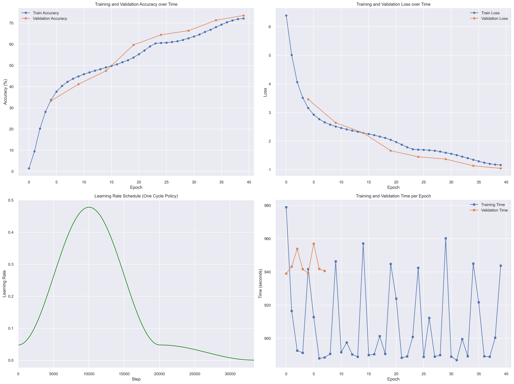
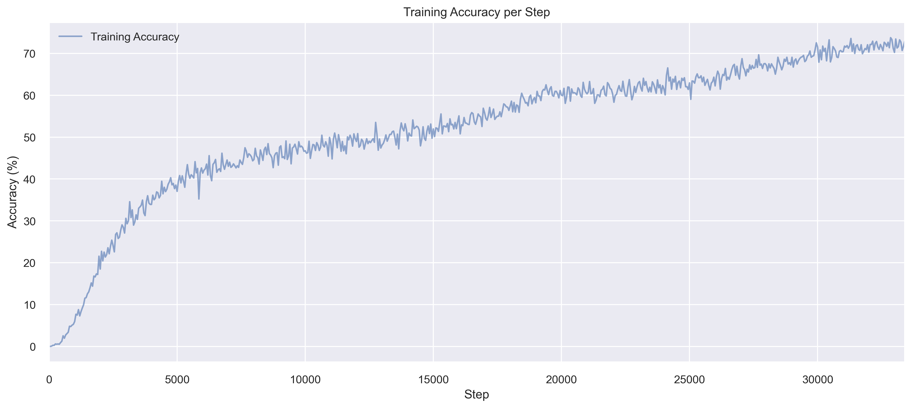

# ImageNet Classification with ResNet50

## Project Overview
This project implements a ResNet50 model for image classification on the ImageNet-1K dataset using PyTorch Lightning. The model is trained to classify images into 1000 different categories and includes a user-friendly Gradio interface for making predictions.

## Key Features
- ResNet50 model from torchvision
- Training on ImageNet-1K dataset (1000 classes)
- Optimized data loading using pre-generated annotation files
- Learning rate optimization using LR Finder
- Mixed precision training (FP16)
- Distributed training across multiple GPUs
- Gradio web interface for model inference

## Technical Details

### Training Infrastructure
- **Hardware**: AWS g6.12xLarge Instance
  - 4 GPUs
  - 48 vCPUs
  - 24GB memory per GPU
  - Total cost $17

### Training Optimizations
- **Data Loading**: Custom annotation files for faster dataset creation instead of ImageFolder
- **Learning Rate**: 
  - Used LR Finder for 500 steps to find optimal learning rate
  - Implemented One Cycle Policy for learning rate scheduling
  - Total training steps: 33,399
- **Training Speed**:
  - FP16 precision for faster training
  - Distributed Data Parallel (DDP) training across 4 GPUs
  - Batch size of 384 with gradient accumulation

### Model Configuration
- Architecture: ResNet50
- Number of classes: 1000
- Batch size: 384
- Learning rate: 0.478 (found using LR Finder)
- Training epochs: 40
- Validation frequency: Every 5 epochs

### Training summary
- Final Training Accuracy: 72.16%
- Final Validation Accuracy: 73.55%
- Best Validation Accuracy: 73.55%
- Average Training Time per Epoch: 908.20 seconds
- Total Training Time: 10.09 hours

### Training Metrics

*Figure 1: Training and validation accuracy/loss, Learning rate, and training time per epoch*


*Figure 2: Accuracy per step*

### Training Logs:


## Demo

[Hugging Face APP](https://huggingface.co/spaces/walnash/Resnet50_ImageNet)

## Project Structure 

The key files in this project are:
- `requirements.txt`: Contains the dependencies for the project
- `ResnetNetwork.py`: Implements the ResNet50 model using PyTorch Lightning with custom training logic and LR finder
- `dataset.py`: Contains the ImageNet dataset class and Lightning DataModule with data transformations
- `create_annotations.py`: Utility script to create CSV annotation files for efficient data loading
- `config.py`: Contains all configuration parameters for model training and dataset paths
- `main.py`: Entry point for training, sets up training configuration and launches the training process


## Usage

1. Clone the repository
```
git clone https://github.com/walnashgit/Resnet50Imagenet.git
```
2. Install the dependencies using 
```
pip install -r requirements.txt
```
3. Download the [ImageNet dataset](https://www.kaggle.com/competitions/imagenet-object-localization-challenge) and place it in the `data` directory

4. Run the create_annotations script
```
python create_annotations.py
```
5. Run the training script
```
python main.py
```
